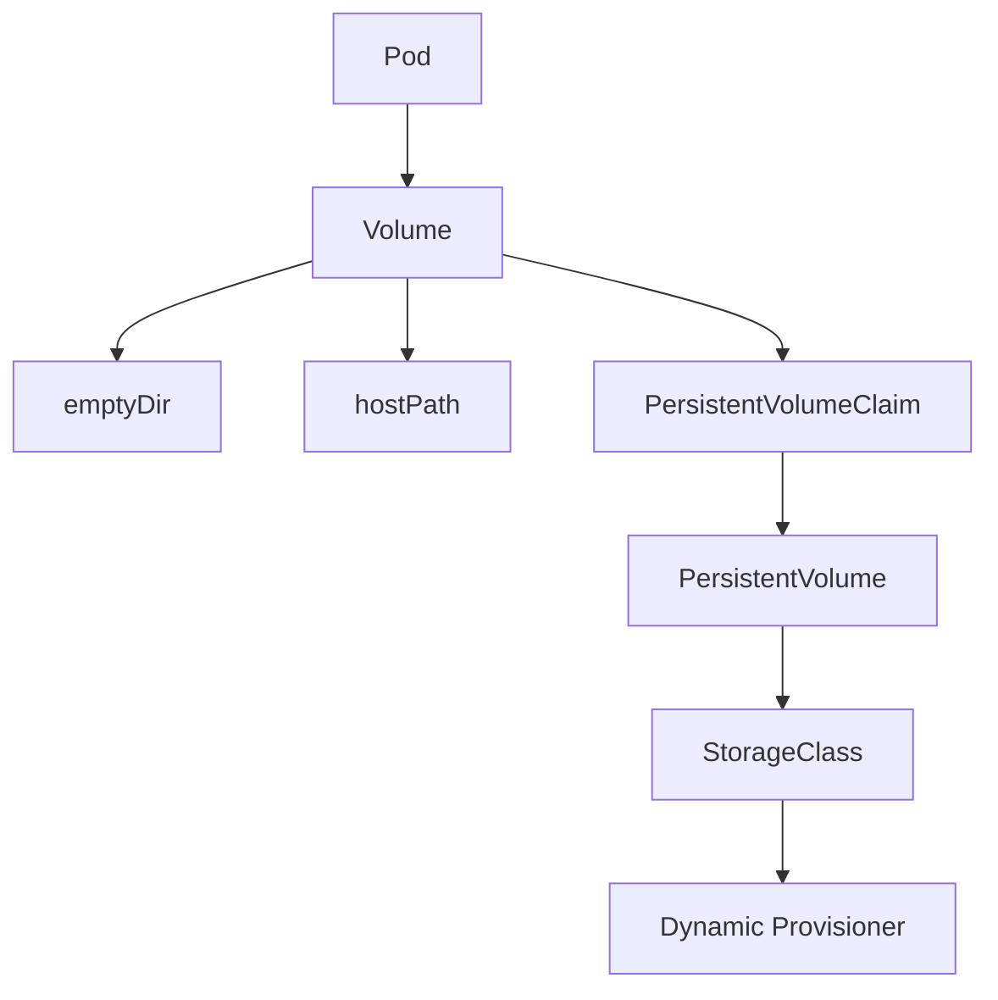
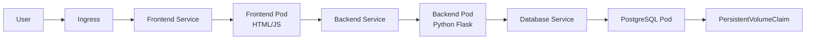
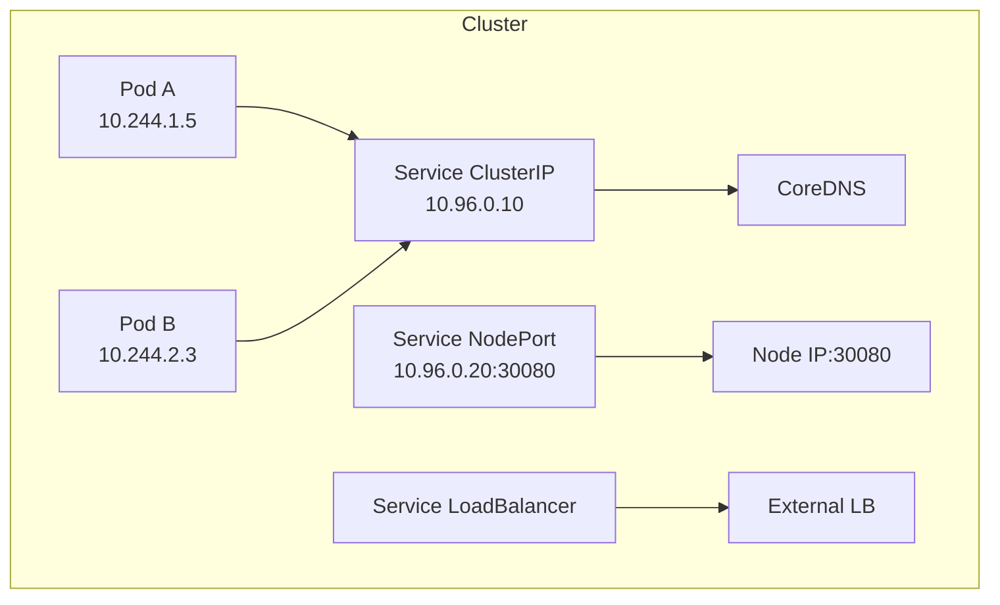

# Plan d'Amélioration du Projet Kubernetes Formation

> Document de référence pour les améliorations futures du projet
> Créé le: 2025-12-14
> Dernière mise à jour: 2025-12-14

## 📊 État Actuel du Projet

### Métriques de Qualité
- **Documentation**: 9.5/10 - 16,400+ lignes, très complète
- **Couverture Tests**: 8.5/10 - Excellente pour TP3-9, manquante pour TP1-2
- **Qualité Code**: 9/10 - Cohérent, professionnel, bien validé
- **Complétude**: 8/10 - Couvre l'essentiel, place pour expansion avancée
- **Utilisabilité**: 9/10 - Progression claire, bonne structure

**Score Global: 9/10** ⭐

### Points Forts
✅ 9 TPs progressifs (débutant → avancé)
✅ Infrastructure CI/CD de niveau production (12 jobs de test)
✅ Préparation CKAD complète (65+ exercices)
✅ Documentation exceptionnelle (16,400+ lignes)
✅ Focus pratique et production-ready
✅ Tests automatisés rigoureux
✅ Pratiques modernes (GitOps, Helm, Kustomize, ArgoCD, Tekton)

---

## 🎯 Améliorations Prioritaires

### 🔴 PRIORITÉ HAUTE

#### 1. Compléter la Couverture de Tests
**Problème**: TP1 et TP2 n'ont pas de tests d'intégration dédiés

**Actions**:
- [ ] Créer `tp1/test-tp1.sh`
  - Valider installation kubectl/minikube
  - Tester déploiements basiques
  - Vérifier rolling updates
- [ ] Créer `tp2/test-tp2.sh`
  - Valider manifests YAML
  - Tester Pods, Deployments, Services
  - Vérifier ConfigMaps et Secrets
- [ ] Ajouter test E2E pour TP7
  - Déployer application complète
  - Tester frontend ↔ backend ↔ database
  - Valider migration Docker Compose → K8s
- [ ] Ajouter validation automatique exercices CKAD
  - Script de validation des solutions
  - Tests de régression

**Effort estimé**: Moyen (2-3 jours)
**Impact**: Élevé - Améliore fiabilité et confiance

#### 2. Ajouter Documentation Visuelle
**Problème**: Documentation uniquement textuelle, manque de diagrammes

**Actions**:
- [ ] Créer diagrammes d'architecture (Mermaid)
  - Vue d'ensemble projet (README principal)
  - Architecture TP3 (Volumes, PV, PVC)
  - Architecture TP7 (Frontend-Backend-DB)
  - Architecture TP8 (Topologie réseau)
- [ ] Ajouter schémas réseau TP8
  - CNI plugins
  - Services types (ClusterIP, NodePort, LoadBalancer)
  - NetworkPolicies
- [ ] Visualiser stratégies déploiement TP6
  - Rolling Update (diagramme animation)
  - Blue/Green deployment
  - Canary deployment
- [ ] Créer flowcharts troubleshooting
  - Diagnostic pods qui ne démarrent pas
  - Debug services réseau
  - Résolution problèmes RBAC

**Effort estimé**: Moyen (3-4 jours)
**Impact**: Élevé - Facilite compréhension et apprentissage

#### 3. Traduction Anglaise
**Problème**: Projet uniquement en français, limite audience internationale

**Actions**:
- [ ] Traduire README principal en anglais
- [ ] Créer structure bilingue (fr/en)
- [ ] Traduire TP1 (débutant)
- [ ] Traduire TP2 (manifests)
- [ ] Traduire TP3 (storage)
- [ ] Traduire documentation CKAD
- [ ] Ajouter sélecteur de langue

**Effort estimé**: Élevé (5-7 jours pour TP1-3 + docs principales)
**Impact**: Très élevé - Ouvre projet à audience mondiale

---

### 🟡 PRIORITÉ MOYENNE

#### 4. Enrichir Exemples d'Applications
**Problème**: Utilisation principalement nginx/busybox, peu d'apps réelles

**Actions**:
- [ ] Créer application e-commerce microservices
  - Frontend (React/Vue)
  - API Gateway
  - Service produits (Python/Flask)
  - Service commandes (Node.js)
  - Service paiement (Go)
  - Base de données (PostgreSQL + Redis)
- [ ] Ajouter exemple observabilité complète
  - Application instrumentée (Prometheus metrics)
  - Logs structurés (JSON)
  - Traces distribuées (OpenTelemetry)
- [ ] Créer app multi-langages
  - Frontend: JavaScript
  - Backend API: Go
  - Worker: Python
  - Analytics: Java

**Effort estimé**: Élevé (7-10 jours)
**Impact**: Moyen-Élevé - Exemples plus proches réalité professionnelle

#### 5. Ajouter Sujets Avancés
**Problème**: Certains sujets avancés seulement mentionnés

**Actions**:
- [ ] **TP10 - Service Mesh (Istio/Linkerd)**
  - Installation et configuration
  - Traffic management
  - Observabilité (métriques, traces)
  - Sécurité (mTLS)
  - Circuit breakers, retry policies
- [ ] **TP11 - Operators et CRDs**
  - Créer CRD custom
  - Développer operator simple (Go/Python)
  - Déployer avec OLM
  - Cas d'usage (bases de données, monitoring)
- [ ] **Expansion TP9 - Multi-cluster**
  - Federation v2 (KubeFed)
  - Cluster API
  - GitOps multi-cluster (ArgoCD/Flux)
- [ ] **TP12 - Sécurité Avancée**
  - Falco (runtime security)
  - OPA/Gatekeeper (policy enforcement)
  - Trivy operator
  - Security auditing

**Effort estimé**: Très élevé (15-20 jours)
**Impact**: Élevé - Complète formation niveau expert

#### 6. Contenu Vidéo
**Problème**: Aucun contenu multimédia

**Actions**:
- [ ] Enregistrer walkthroughs TP1-TP3
- [ ] Créer playlist YouTube
- [ ] Animations concepts clés
  - Comment fonctionne un Pod
  - Service discovery
  - Rolling update
  - Scheduler
- [ ] Screencasts procédures complexes
  - Setup cluster kubeadm
  - Debug NetworkPolicies
  - Configuration Prometheus/Grafana

**Effort estimé**: Élevé (10-15 jours)
**Impact**: Moyen - Améliore accessibilité apprentissage

#### 7. Guides de Dépannage
**Problème**: Pas de section troubleshooting dédiée

**Actions**:
- [ ] Créer `docs/TROUBLESHOOTING.md`
  - Erreurs communes par TP
  - Solutions étape par étape
  - Commandes de diagnostic
- [ ] FAQ par TP
  - Questions fréquentes étudiants
  - Pièges courants
  - Bonnes pratiques
- [ ] Flowcharts diagnostic
  - Pod en CrashLoopBackOff
  - Service inaccessible
  - PVC en Pending
  - Image pull errors

**Effort estimé**: Moyen (3-5 jours)
**Impact**: Moyen-Élevé - Réduit friction apprentissage

---

### 🟢 PRIORITÉ BASSE

#### 8. Apprentissage Interactif
**Actions**:
- [ ] Créer scénarios Killercoda
- [ ] Ajouter Terraform/Vagrant pour provisioning labs
- [ ] Sections quiz interactives
- [ ] Exercices auto-corrigés

**Effort estimé**: Très élevé (20+ jours)
**Impact**: Moyen - Améliore engagement

#### 9. Tests de Performance
**Actions**:
- [ ] Exemples load testing (k6, JMeter)
- [ ] Guides benchmarking
- [ ] TP optimisation performance
- [ ] Profiling ressources

**Effort estimé**: Moyen (5-7 jours)
**Impact**: Faible-Moyen - Niche avancée

#### 10. Fonctionnalités Communautaires
**Actions**:
- [ ] CONTRIBUTING.md détaillé
- [ ] Templates issues GitHub
- [ ] Pull request template
- [ ] Code of conduct
- [ ] Discussion forum

**Effort estimé**: Faible (1-2 jours)
**Impact**: Moyen - Favorise contributions

#### 11. Améliorations CI/CD
**Actions**:
- [ ] Tests régression performance
- [ ] Analyse complexité manifests
- [ ] Score sécurité automatique
- [ ] Validation liens documentation

**Effort estimé**: Moyen (3-4 jours)
**Impact**: Faible-Moyen - Optimisation qualité

#### 12. Accessibilité
**Actions**:
- [ ] Alt text pour diagrammes futurs
- [ ] Documentation compatible screen readers
- [ ] Exemples code haut contraste
- [ ] Navigation clavier optimisée

**Effort estimé**: Faible (2-3 jours)
**Impact**: Faible-Moyen - Inclusivité

---

## 📋 Plan d'Exécution Recommandé

### Phase 1 - Fondations (Sprint 1-2, ~2-3 semaines)
1. ✅ Compléter tests TP1-TP2
2. ✅ Ajouter diagrammes architecture principaux
3. ✅ Créer guide troubleshooting de base

### Phase 2 - Internationalisation (Sprint 3-4, ~3-4 semaines)
4. ✅ Traduire README principal + TP1-3 en anglais
5. ✅ Mettre en place structure bilingue
6. ✅ Traduire documentation CKAD

### Phase 3 - Enrichissement (Sprint 5-7, ~4-6 semaines)
7. ✅ Créer application microservices exemple
8. ✅ Développer TP10 (Service Mesh)
9. ✅ Ajouter guides troubleshooting avancés

### Phase 4 - Multimédia (Sprint 8-10, ~4-6 semaines)
10. ✅ Enregistrer vidéos TP1-3
11. ✅ Créer animations concepts clés
12. ✅ Développer scénarios interactifs

### Phase 5 - Expert (Sprint 11-15, ~6-8 semaines)
13. ✅ TP11 Operators et CRDs
14. ✅ TP12 Sécurité avancée
15. ✅ Expansion multi-cluster TP9

---

## 🔧 Améliorations Techniques Détaillées

### Tests TP1
```bash
# Structure fichier test-tp1.sh
#!/bin/bash

# Vérifications prérequis
check_kubectl_installed()
check_minikube_installed()
check_docker_installed()

# Tests déploiement
test_create_deployment()
test_expose_service()
test_rolling_update()
test_rollback()

# Cleanup
cleanup_resources()
```

### Tests TP2
```bash
# Structure fichier test-tp2.sh
#!/bin/bash

# Tests manifests
test_pod_creation()
test_deployment_creation()
test_service_creation()
test_configmap_usage()
test_secret_usage()
test_labels_selectors()
test_namespace_isolation()

# Validation
validate_best_practices()
```

### Diagrammes Architecture (Mermaid)

#### TP3 - Storage


#### TP7 - Application


#### TP8 - Réseau


### Structure Bilingue
```
/
├── README.md (français)
├── README.en.md (anglais)
├── tp1/
│   ├── README.md (français)
│   └── README.en.md (anglais)
├── docs/
│   ├── fr/
│   │   ├── TROUBLESHOOTING.md
│   │   └── ADVANCED.md
│   └── en/
│       ├── TROUBLESHOOTING.md
│       └── ADVANCED.md
```

---

## 📈 Métriques de Succès

### Indicateurs Qualité
- [ ] Couverture tests: 95%+ (actuellement ~85%)
- [ ] Documentation bilingue: 100% TP1-3 + docs principales
- [ ] Diagrammes: Au moins 1 par TP
- [ ] Guides troubleshooting: 1 par TP

### Indicateurs Engagement
- [ ] Stars GitHub: +50% sur 6 mois
- [ ] Contributors: 5+ contributeurs actifs
- [ ] Issues résolus: <48h moyenne
- [ ] Pull requests: 1+ par mois (communauté)

### Indicateurs Pédagogiques
- [ ] Taux complétion: Suivre analytics
- [ ] Feedback positif: >90%
- [ ] Temps moyen par TP: Correspondre estimations
- [ ] Taux réussite CKAD: >80% pour participants

---

## 🎓 Ressources et Références

### Outils Recommandés
- **Diagrammes**: Mermaid.js (intégré Markdown)
- **Vidéos**: OBS Studio, Camtasia
- **Labs interactifs**: Killercoda, Instruqt
- **Traduction**: DeepL API, Google Translate API
- **Tests**: Ginkgo (Go), Pytest (Python)

### Inspirations Projets
- Kubernetes The Hard Way (Kelsey Hightower)
- CKAD Exercises (dgkanatsios)
- Kubernetes By Example
- KillerCoda scenarios

### Documentation Kubernetes
- kubernetes.io/docs
- kubernetes.io/blog
- CNCF Training

---

## 📝 Notes et Suivi

### Changelog Améliorations
| Date | Amélioration | Priorité | Status |
|------|-------------|----------|--------|
| 2025-12-14 | Document créé | - | ✅ |
| | | | |
| | | | |

### Décisions Architecturales
- **Langue principale**: Français (audience cible)
- **Langue secondaire**: Anglais (portée internationale)
- **Format diagrammes**: Mermaid (facilité maintenance)
- **Plateforme vidéos**: YouTube (accessibilité)
- **Labs interactifs**: Killercoda (gratuit, K8s natif)

### Feedback Reçu
_À compléter au fur et à mesure des retours utilisateurs_

---

## 🤝 Contribution

### Comment Contribuer aux Améliorations
1. Choisir une amélioration dans ce document
2. Créer issue GitHub avec label `enhancement`
3. Proposer PR avec référence issue
4. Mettre à jour ce document (statut ✅)

### Contact Mainteneurs
- GitHub Issues: Recommandé
- Discussions: Pour questions ouvertes

---

**Document vivant** - À mettre à jour régulièrement avec progression et nouveaux besoins identifiés.

*Dernière révision: 2025-12-14*
